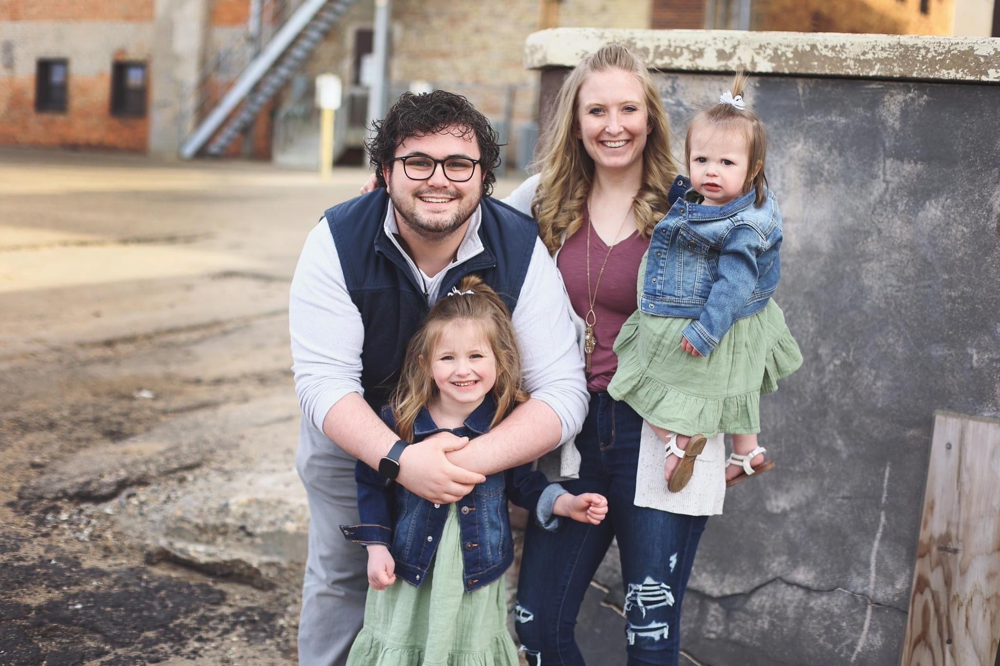
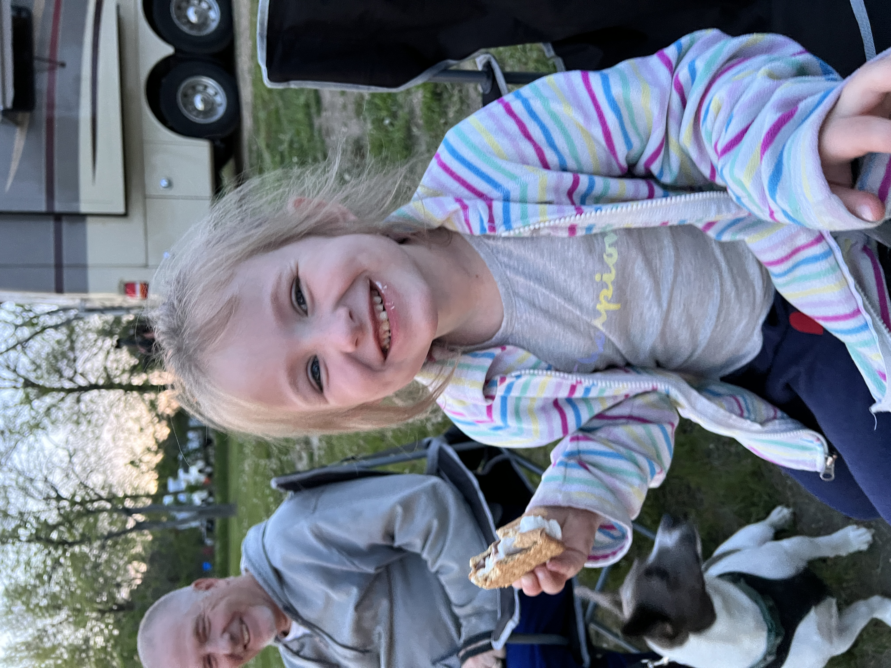
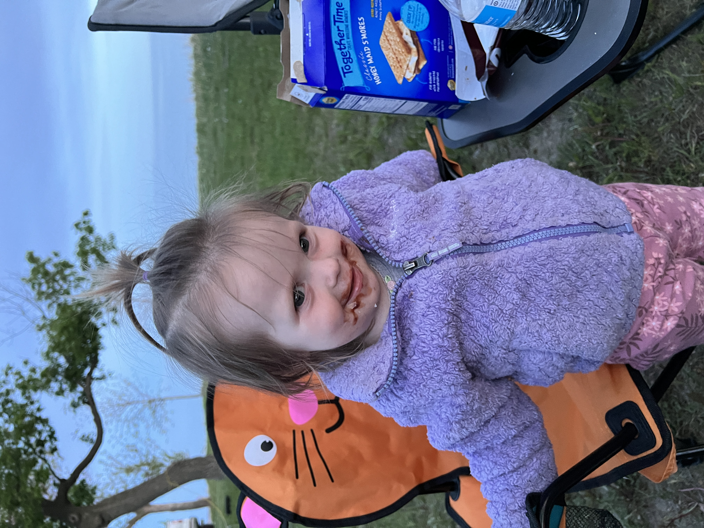
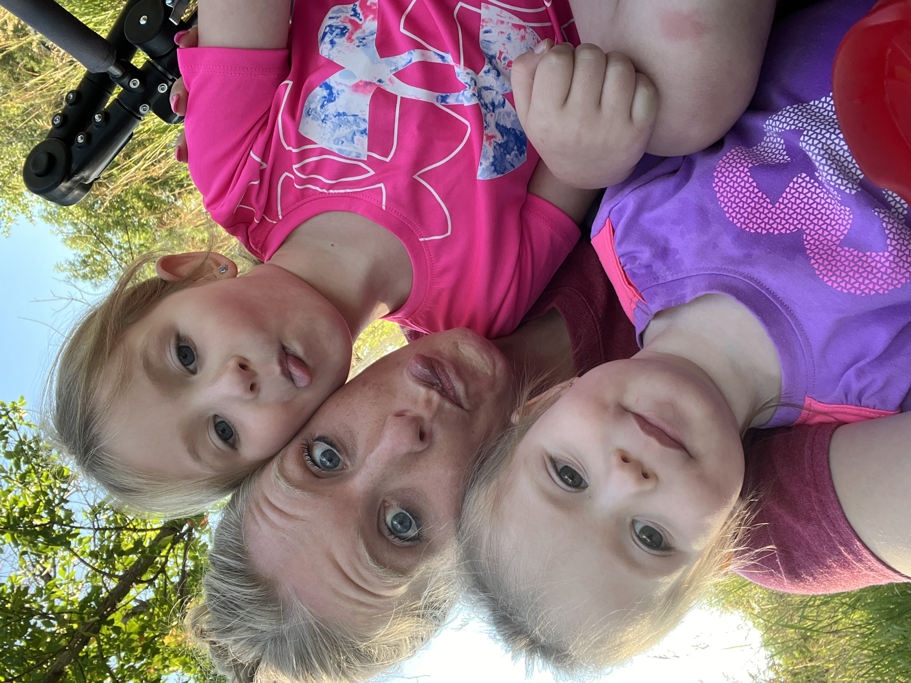
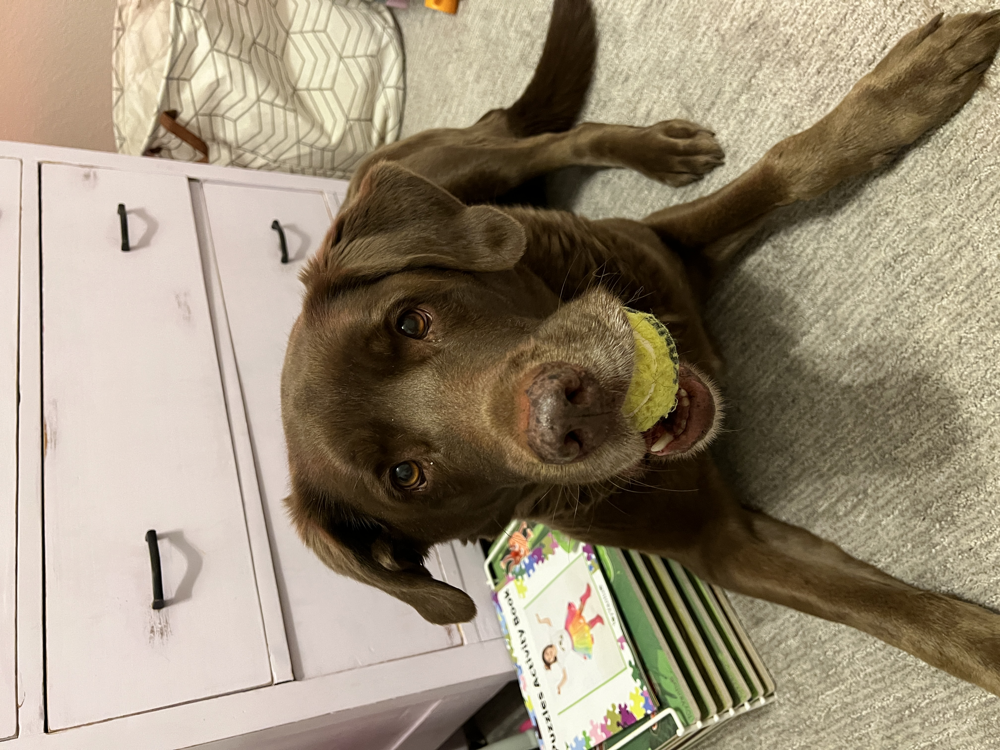
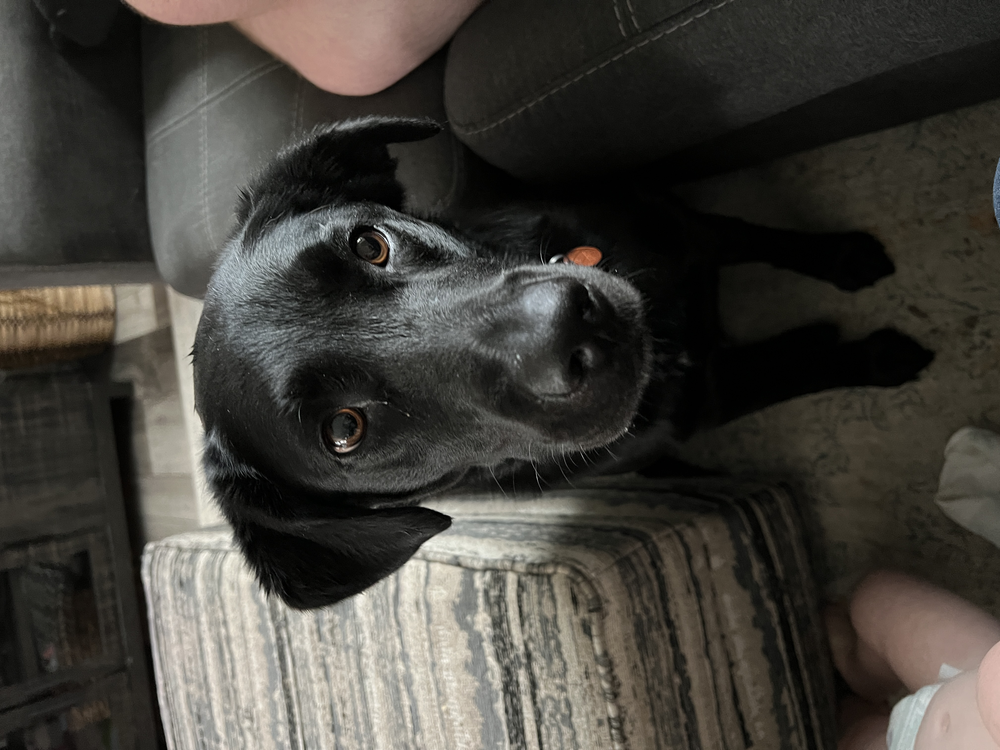

# Emily Biggane, PhD

### Scientist, Wife, and Mother

I am Research Faculty in the Intertribal Research and Resource Center and United Tribes Technical College in Bismarck, ND. I'm a cell and molecular biologist, by training, with a broad focus on environmentally-linked cancers. I have an interest in incorporating environmental data to more holistically understand the environment's impact on molecular dysregulation of critical cell processes associated with cancer risk, initiation, and progression.

I grew up in Minot, North Dakota and am the oldest of 3 kids. I graduated from Minot State University with a Bachelor's Degree in Biology where I studied a chromosomal translocation commonly seen in Acute Myeloid Leukemia, under the mentorship of Dr. Heidi Super. I then went on to graduate school in the Biomedical Sciences PhD program at the University of North Dakota in Grand Forks, ND. My research, under the mentorship of Dr. Jane Dunlevy, focused on a specific protein, SPARC, that is completely repressed in bladder cells following malignant transformation from exposure to the heavy metal cadmium.

I'm a wife to a fellow scientist and a mother to two beautiful daughters and a handsome new son! We enjoy camping, being outside, spending time with our dogs, and being with friends.

     

